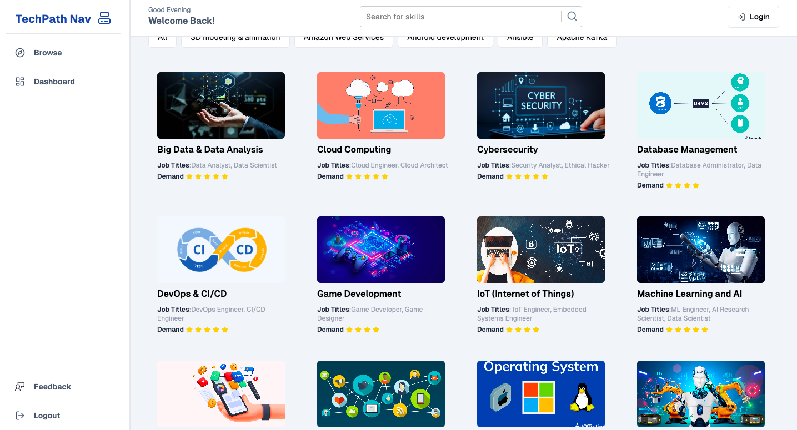

# TechPath Navigator



## Revolutionizing Tech Careers in Africa

### Problem Statement

The tech industry in Africa is rapidly growing and evolving, presenting abundant opportunities for aspiring professionals. However, the lack of adequate career guidance can lead to misinformed decisions and skills mismatches, hindering career growth.

### Solution

The TechPath Navigator platform aims to address this challenge by providing personalized career guidance to African tech graduates. The platform leverages a matching algorithm to analyze user skills and interests against industry data, offering tailored career recommendations, skill assessment tools, and comprehensive career information.

### Features

- **Skill Assessment:** Assess individual skills and competencies to match graduates with suitable career paths and job opportunities.
- **Industry Trends Analysis:** Provide insights into evolving industry trends to ensure graduates stay updated with the dynamic tech sector.
- **Comprehensive Career Information:** Offer detailed information about various career paths, roles, and opportunities available within the African tech industry.
- **Resource Library:** Curate a repository of resources to assist graduates in enhancing their skills and knowledge base.
- **Personalized Job Recommendations:** Suggest job opportunities tailored to individual profiles and skill sets, facilitating smoother transitions into the workforce.

### Benefits

- **Personalized Career Guidance:** Empower graduates to make informed career decisions based on their skills, interests, and the African tech landscape.
- **Enhanced Employability:** Bridge skills gaps and increase graduates' chances of securing employment in their desired tech careers.
- **Informed Career Progression:** Provide graduates with the insights and resources needed to navigate the African tech landscape and advance their careers.

### How to Use

1. Create an account and provide your basic information, skills, and interests.
2. Access your personalized career recommendations and explore the comprehensive career information library.
3. Utilize the skill assessment tools to identify your strengths and areas for improvement.
4. Leverage the resource library to enhance your skills and knowledge base.
5. Apply for job opportunities tailored to your profile and skill set.

### Authors

- Kalisa Honore
- Eldad Gishinge
- Niwenizeye Mugisha Blaine
- Bryan Aurel Bakongo Bwemou
- Ange Marie Iradukunda
- Maxime Mukunzi

### Get Involved

We are committed to building a thriving tech ecosystem in Africa. If you are interested in collaborating with us on the TechPath Navigator project, please reach out to us at [n.blaine@alustudent.com]

### Contributing

We welcome contributions from the community to the TechPath Navigator project. To learn more about how to contribute, please visit our GitHub repository: [TechPath Navigator Repository](https://github.com/honorekalisa/techpath-navigator).


## Demo

You can view a fully working demo at (https://techpath-navigator.vercel.app/).

## Deploy to Vercel

Vercel deployment will guide you through creating a Supabase account and project.

After installation of the Supabase integration, all relevant environment variables will be assigned to the project so the deployment is fully functioning.

[](https://vercel.com/new/clone?repository-url=https%3A%2F%2Fgithub.com%2Fvercel%2Fnext.js%2Ftree%2Fcanary%2Fexamples%2Fwith-supabase&project-name=nextjs-with-supabase&repository-name=nextjs-with-supabase&demo-title=nextjs-with-supabase&demo-description=This%20starter%20configures%20Supabase%20Auth%20to%20use%20cookies%2C%20making%20the%20user's%20session%20available%20throughout%20the%20entire%20Next.js%20app%20-%20Client%20Components%2C%20Server%20Components%2C%20Route%20Handlers%2C%20Server%20Actions%20and%20Middleware.&demo-url=https%3A%2F%2Fdemo-nextjs-with-supabase.vercel.app%2F&external-id=https%3A%2F%2Fgithub.com%2Fvercel%2Fnext.js%2Ftree%2Fcanary%2Fexamples%2Fwith-supabase&demo-image=https%3A%2F%2Fdemo-nextjs-with-supabase.vercel.app%2Fopengraph-image.png&integration-ids=oac_VqOgBHqhEoFTPzGkPd7L0iH6)

The above will also clone the Starter kit to your GitHub, you can clone that locally and develop locally.

If you wish to just develop locally and not deploy to Vercel, [follow the steps below](#clone-and-run-locally).

## Clone and run locally

1. You'll first need a Supabase project which can be made [via the Supabase dashboard](https://database.new)

2. Create a Next.js app using the Supabase Starter template npx command

   ```bash
   npx create-next-app -e with-supabase
   ```

3. Use `cd` to change into the app's directory

   ```bash
   cd name-of-new-app
   ```

4. Rename `.env.local.example` to `.env.local` and update the following:

   ```
   NEXT_PUBLIC_SUPABASE_URL=[INSERT SUPABASE PROJECT URL]
   NEXT_PUBLIC_SUPABASE_ANON_KEY=[INSERT SUPABASE PROJECT API ANON KEY]
   ```

   Both `NEXT_PUBLIC_SUPABASE_URL` and `NEXT_PUBLIC_SUPABASE_ANON_KEY` can be found in [your Supabase project's API settings](https://app.supabase.com/project/_/settings/api)

5. You can now run the Next.js local development server:

   ```bash
   npm run dev
   ```

   The starter kit should now be running on [localhost:3000](http://localhost:3000/).

> Check out [the docs for Local Development](https://supabase.com/docs/guides/getting-started/local-development) to also run Supabase locally.
